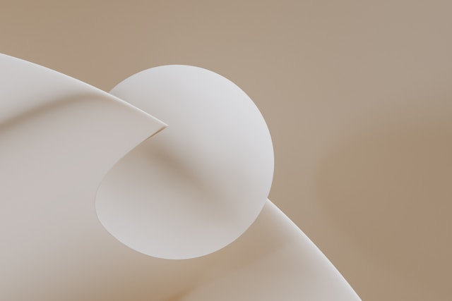
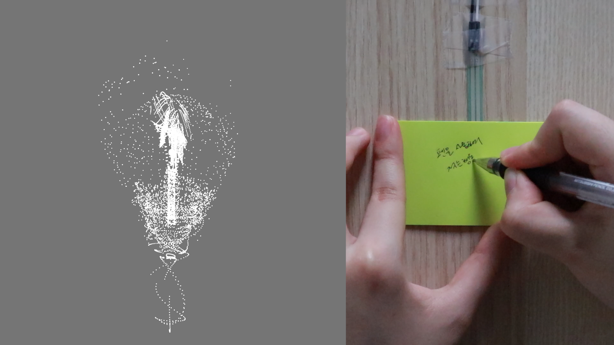
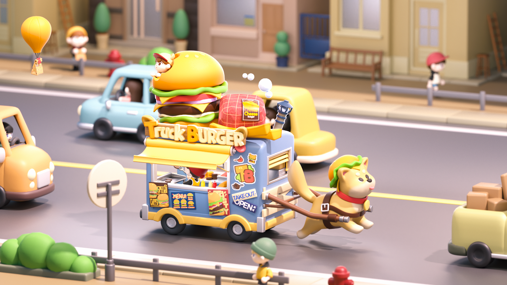

# 2025 seoyeon lee portfolio

광고 디자인, 모션 그래픽, 미디어아트 의 경로를 밟으며 좋아하는 것들을 찾고 있습니다.
현재 예술, 인문에 관한 공부를 하고 있습니다. 

---

**핵심 역량**
- 2D / 3D 키프레임 애니메이션, 모션그래픽
- 센서 기반 인터렉티브 시스템 제작
  
---

## 프로젝트

### 1. The known face

**기간:** 2025.05 – 2025.07  

**기술 스택:** Touchdesigner, Arduino

**요약:**

---

### 2. Particles of Thought

**기간:** 2024.10 

**기술 스택:** Touchdesigner, blender

  복잡한 생각들이 하나로 명확하게 정리되지 않을 때, 머릿속에 얽혀있는 이야기들을 종이에 써 내려가다 보면 어느 순간 정리되지 않던 생각들이 하나로 명확해지는 경험을 한 적이 있습니다. 이 경험을 바탕으로 한 작품을 제작해 보았습니다. ‘정리되지 않아 복잡한 생각’은 넓은 범위에 퍼져있는 파티클로 표현했습니다. 이는 관객이 종이에 글씨를 적거나 그림을 그리는 행동을 반복하다 보면 어떠한 하나의 형태로 선명해집니다. 이때 관객은  완성된 형태를 예상할 수 없습니다. 우리가 고민을 정리하려고 할 때 하나의 선명한 결과를 예상하고 적는 행위를 하는 것이 아니라는 점과, 전혀 예상하지 못한 부분에서 답을 찾기도 한다는 점에서 이 작품은 ‘모든 끄적이는 행동이 생각의 형태를 명확하게 만드는 것에 기여한다’는 의미에 초점을 맞추어 제작했습니다. 압력센서(FSR406)와 아두이노를 사용하여 종이에 펜이 닫는 세기의 정보 값을 받아내어 입력 데이터로 사용했습니다. 이후 변화하는  데이터에 따른 그래픽 작업은 Touchdesigner를 사용했습니다.

[프로젝트 보기](https://youtu.be/6BFqCDFq0i0)

---

### 3. 휴식의 공간

**기간:** 2024.06 – 2024.08

**기술 스택:** Cinema 4D, Touchdesigner, Arduino

  사람들은 그마다 각각 다른 방식의 '쉼'을 갖습니다. 이는 제가 느끼는 '쉼'이 무엇인지 파악하는 과정중 하나로 진행된 작업입니다. 작업실과도 같은 제 방의 한편에 쉼의 공간을 마련한 것입니다. 첫 번째로 보여지는 공간은 햇살이 드는 빈 공간을 제작했습니다. 어떠한 행동도 휴식이 될 수 있으며 이를 하나씩 채워나가게될 것을 의미합니다. 공간을 떠도는 솜구름은 그 속에서 안정을 느끼고 에너지를 충전하는 나를 의미합니다. 두 번째 공간은 제가 발견한 첫번째 '쉼'을 표현했습니다. 아늑하면서도 따듯하고 포근한 공간, 마치 이불 속 같은 공간과 분위기 저는 대체로 온전한 휴식을 느끼며 이를 표현했습니다. 해당 작품은 방 한 공간의 옷장으로 연결된 문에 매핑하여 작업하였습니다. 공간의 전환은 방문을 두드리는 노크로 전환됩니다. 충격센서를 활용하여 노크시 충격이 전달되면 다음 공간으로 넘어가도록 제작하였습니다

[프로젝트 보기](https://youtu.be/Xln6hgFEKow)

---

### 4. Truch Burger

**기간:** 2024.04 – 2024.05

**기술 스택:**  Cinema 4D, octane render

  빠름이 중요해진 사회와 그에 따라 빠른 배달을 내세우며 경쟁하는 배달업계를 보며 ‘이러다 푸드트럭이 도로를 달리며 음식을 판매하게 되는건 아닐까?’라는 재밌는 상상을 시작으로 제작된 영상입니다. “도로 위를 달리는 햄버거 가게”라는 컨셉으로 <Truck Burger>라는 가게를 설정한 뒤 이를 표현하기 위해 3D 애니메이션을 제작했습니다. 햄버거가 갖는 컬러와 조화롭다는 점에서 커다란 시바견을 재미 포인트로 사용하였습니다.

[프로젝트 보기](https://youtu.be/2zZeqPragWw)

---

## 기술 스택

| 분야 | 도구 |
|------|------|
| 2D | Adobe 계열 / PS AI AE ID |
| 3D | Cinema 4D |
| 그외 | Touchdesigner |

---

## 학력 및 이력

- **국립공주대학교 영상학과** (2020–2024)
- **연세대학교 커뮤니케이션대학원 미디어아트 전공** (2025- )

---

## 연락처

| 구분 | 내용 |
|------|------|
| 이메일 | leesy2028@naver.com |
